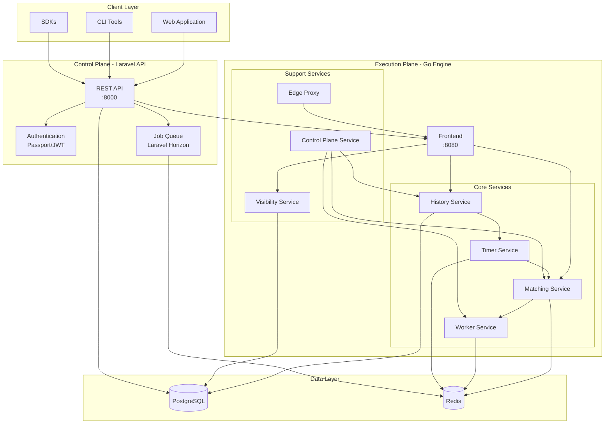
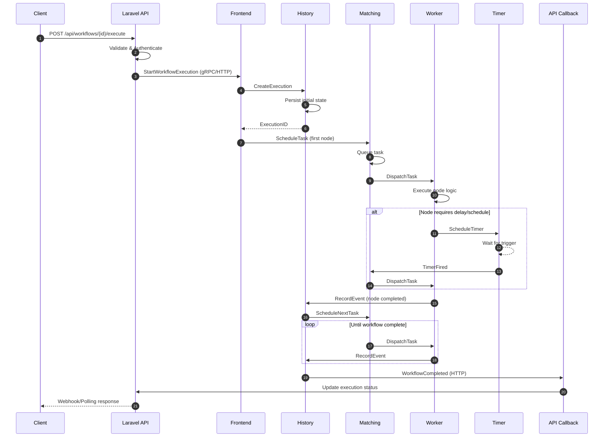

# LinkFlow Architecture

## Overview

**LinkFlow** is a high-performance, scalable workflow automation platform built with a hybrid microservices architecture. It combines the ease of use of a Laravel-based API (control plane) with the raw performance and concurrency of a Go-based execution engine.

The platform enables users to design, execute, and monitor complex workflows with features like HTTP requests, AI integrations, scheduling, and event-driven automation.

---

## System Architecture

LinkFlow follows a hybrid architecture pattern with clear separation between the control plane (Laravel API) and the data/execution plane (Go Engine).



---

## Component Details

### API (Laravel)

The Laravel API serves as the control plane, handling all user-facing operations.

| Component | Description |
|-----------|-------------|
| **REST API** | RESTful endpoints for workflows, executions, users, and integrations |
| **Authentication** | Laravel Passport/JWT-based authentication and authorization |
| **Job Queue** | Async job processing via Laravel Horizon with Redis backend |
| **User Management** | User accounts, teams, API keys, and permissions |
| **Webhooks** | Inbound webhook handling for workflow triggers |

**Key Directories:**
- `app/Http/` - Controllers, Middleware, Requests
- `app/Models/` - Eloquent models
- `app/Services/` - Business logic services
- `app/Jobs/` - Queue jobs
- `routes/api.php` - API route definitions

### Engine Microservices (Go)

The Go Engine consists of 8 specialized microservices:

| Service | Port | Description |
|---------|------|-------------|
| **Frontend** | 8080 | API Gateway and request router. Entry point for all engine operations. |
| **History** | Internal | Event sourcing store. Maintains workflow execution state and event history. |
| **Matching** | Internal | Task queuing and worker dispatching. Routes tasks to appropriate workers. |
| **Worker** | Internal | Executes workflow nodes (HTTP calls, AI invocations, transformations, etc.). |
| **Timer** | Internal | Handles scheduling, delays, cron triggers, and timeout management. |
| **Visibility** | Internal | Provides search and listing capabilities for workflow executions. |
| **Control Plane** | Internal | Cluster management, configuration distribution, and health monitoring. |
| **Edge** | 8081 | Edge proxy service for external connectivity and load balancing. |

**Key Directories:**
- `cmd/` - Service entry points
- `internal/` - Service implementations
- `pkg/` - Shared libraries
- `api/` - gRPC/Protobuf definitions

---

## Data Flow

The following diagram illustrates how a workflow execution flows through the system:



---

## Communication Patterns

### API to Engine

| Protocol | Use Case |
|----------|----------|
| **HTTP/REST** | Simple operations, health checks, status queries |
| **gRPC** | High-performance operations, workflow execution, streaming |

### Inter-Service (Engine)

| Protocol | Use Case |
|----------|----------|
| **gRPC** | Primary communication between all Go microservices |
| **Redis Pub/Sub** | Event broadcasting, real-time updates |
| **Redis Streams** | Task queuing, reliable message delivery |

### Callbacks (Engine to API)

| Protocol | Use Case |
|----------|----------|
| **HTTP** | Workflow completion notifications, status updates |
| **Signed Requests** | Uses `LINKFLOW_SECRET` for authentication |

### Security

- All inter-service communication uses TLS in production
- Callbacks are authenticated using HMAC signatures
- API authentication via Laravel Passport (OAuth2) or JWT

---

## Technology Stack

| Layer | Technology | Version | Purpose |
|-------|------------|---------|---------|
| **API Framework** | Laravel | 11.x | REST API, Authentication, Queue |
| **API Language** | PHP | 8.2+ | Server-side logic |
| **Engine Language** | Go | 1.23+ | High-performance execution |
| **Database** | PostgreSQL | 16 | Primary data store |
| **Cache/Queue** | Redis | 7 | Caching, job queues, pub/sub |
| **RPC Framework** | gRPC + Protobuf | - | Inter-service communication |
| **Container** | Docker | 20+ | Containerization |
| **Orchestration** | Docker Compose | 2.20+ | Local development |
| **API Docs** | OpenAPI/Swagger | 3.0 | API documentation |

---

## Directory Structure

```
lnkflow/
├── apps/
│   ├── api/                    # Laravel API Application
│   │   ├── app/
│   │   │   ├── Http/           # Controllers, Middleware
│   │   │   ├── Models/         # Eloquent Models
│   │   │   ├── Services/       # Business Logic
│   │   │   ├── Jobs/           # Queue Jobs
│   │   │   └── Providers/      # Service Providers
│   │   ├── config/             # Configuration files
│   │   ├── database/           # Migrations, Seeders
│   │   ├── routes/             # Route definitions
│   │   └── tests/              # PHPUnit tests
│   │
│   └── engine/                 # Go Engine Application
│       ├── cmd/                # Service entry points
│       │   ├── frontend/       # API Gateway
│       │   ├── history/        # Event Store
│       │   ├── matching/       # Task Router
│       │   ├── worker/         # Task Executor
│       │   ├── timer/          # Scheduler
│       │   ├── visibility/     # Search Service
│       │   ├── control-plane/  # Cluster Manager
│       │   └── edge/           # Edge Proxy
│       ├── internal/           # Private packages
│       ├── pkg/                # Shared libraries
│       ├── api/                # Protobuf definitions
│       └── configs/            # Configuration files
│
├── infra/                      # Infrastructure
│   ├── init/                   # Database init scripts
│   └── docker-compose.yml      # PostgreSQL, Redis
│
├── scripts/                    # Build & deployment scripts
├── docker-compose.yml          # Root orchestration
├── Makefile                    # Unified commands
└── README.md                   # Project documentation
```

---

## Deployment Ports

| Service | Port | Protocol |
|---------|------|----------|
| Laravel API | 8000 | HTTP |
| Engine Frontend | 8080 | HTTP/gRPC |
| Engine Edge | 8081 | HTTP |
| PostgreSQL | 5432 | TCP |
| Redis | 6379 | TCP |

---

## Related Documentation

- [README.md](../README.md) - Getting started guide
- [apps/api/README.md](../apps/api/README.md) - API documentation
- [apps/engine/DOCKER.md](../apps/engine/DOCKER.md) - Engine Docker guide
- [infra/README.md](../infra/README.md) - Infrastructure setup
